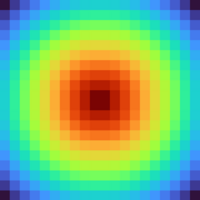
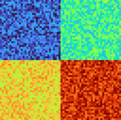
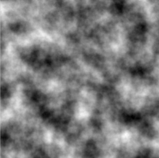

# BQN Viewmat

This is a clone of [J's Viewmat](https://code.jsoftware.com/wiki/Studio/Viewmat) addon for displaying matrices.

It relies on [raylib-bqn](https://github.com/Brian-ED/raylib-bqn).

Currently the paths to both `libraylib.so` and `raylib.bqn` are hardcoded in `viewmat.bqn` so you will most likely need to modify those values to get it working

# Usage and examples

First pull in Viewmat and some color palettes
```bqn
Viewmat‿viridis‿grayscale ← •Import "viewmat.bqn"
```

### Simple burst

```bqn
Viewmat -∾˜⟜⌽∘⍉⍟2+⌾(ט)˝⍉⁼>↕10‿10
```


### Multi-dim arrays

```bqn
Viewmat [1‿2⋄3‿4] + 2‿2‿32‿32 •rand.Range 0
```


### One dimensional is OK too! 

```bqn
Viewmat ↕10
```


### Voronoi

```bqn
c ← >↕∾˜z ← 400
p ← 50‿2 •rand.Range z
m ← (⊑⊢⊐⌊´)⎉1 +˝⎉1ט c -⎉1⎉1‿∞ p
viridis Viewmat m
```
A vibrant _verde_ Voronoi visualiaion. _Voila!_


### Perlin noise

Using `perlin.bqn` from [bqn-libs](https://github.com/mlochbaum/bqn-libs) to generate noise

```bqn
NoiseN‿MakeData ← •Import "perlin.bqn"
state ← MakeData@
Viewmat >state⊸NoiseN¨50÷˜↕400‿400
```


Generate noise at multiple scales and sum for fractal noise
```bqn
grayscale Viewmat +˝ (2⋆↕6) {𝕨×>state⊸NoiseN¨𝕨÷˜𝕩}○⊑˘ <↕200‿200
```


### RGB

Passing "rgb" as the pallette will attempt to interpret the values as 24-bit RGB.
This means you need to manually convert constructed RGB to 24-bit values.

```bqn
AntiBase ← {+⟜(𝕨⊸×)´⌽≍⍟(1=≠)𝕩}
rgb ← ⍉2÷˜•math.Sin÷⟜10(+⌜∾⌈⌜≍-˜⌜)˜↕300
"rgb" Viewmat 256⊸Antibase˘˘⌊255×0.5+rgb
```


Additionally, "rgba" is supported if you want to pass in an alpha channel (32-bit RGB).

**TODO**: Add support for arrays of m×n×3 with the "rgb" palette to avoid the user having to to the conversion.

# Caveats and limitation

Only tested on Linux, but presumably works anywhere `raylib.bqn` works.

When I run Viewmat in the BQN repl, I cannot close the window.
I'm not sure if this is an issue on my end. Running Viewmat in a script seems to work fine.
